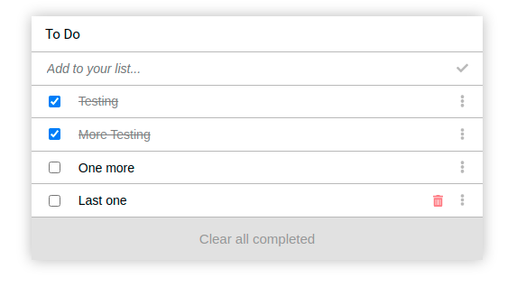

<p align="center">
  <a href="https://www.microverse.org/">
    
  </a>
  <a href="https://github.com/VanessaAoki/To-Do-List/blob/main/LICENSE">
    
  </a>
  <a href="https://github.com/VanessaAoki/To-Do-List">
    
  </a>
  <a href="https://github.com/VanessaAoki/To-Do-List">
    
  </a>
  <a href="https://github.com/VanessaAoki">
    
  </a>
</p>

# To Do list

"To-do list" is a tool that helps to organize your day. It simply lists the things that you need to do and allows you to mark them as complete.

<p align="center">
    
</p>

## Built With

- HTML, CSS, JavaScript & Webpack;
- Visual Studio, Git & GitHub;

## Getting Started

### Running locally
To run this project, you only need a computer with a browser (like Google Chrome, Mozilla Firefox, Microsoft Edge, Apple Safari, etc.) installed, and follow these steps:

1. In your terminal, type the following, to clone this repository:

```sh
$ git clone git@github.com:VanessaAoki/To-Do-List.git
```

2. After, run the following commands in your terminal:

```sh
$ cd To-Do-List
$ npm install
$ cd dist
```
<details align="right">
<summary><small>What are these commands?</summary>
- the `$ cd` command is used to move to different folders. <br>
- while `$ npm build` is used to compile the aplication files.</small>
</details>

3. Open the `index.html` file and run the application;

### Live demo
Alternatively, you can run the app through the [live demo link](https://vanessaaoki.github.io/To-Do-List/).

## Author

👩🏼‍💻 **Vanessa Aoki**

- GitHub: [@VanessaAoki](https://github.com/VanessaAoki)
- Twitter: [@VanessaSAoki](https://twitter.com/VanessaSAoki)
- Linkedin: [Vanessa Aoki](https://www.linkedin.com/in/vanessasaoki/)

## Acknowledgments

Shoutouts to [Nelsino Francisco](https://github.com/nelsinofrancisco), all tests and lots of codes improvements were written with him!

## 🤝 Contributing

Contributions, issues, and feature requests are welcome!

Feel free to check the [issues page](https://github.com/VanessaAoki/Webpack-Setup/issues).

## Show your support

Give a ⭐️ if you like this project!

## 📝 License

This project is [MIT](./LICENSE) licensed.
